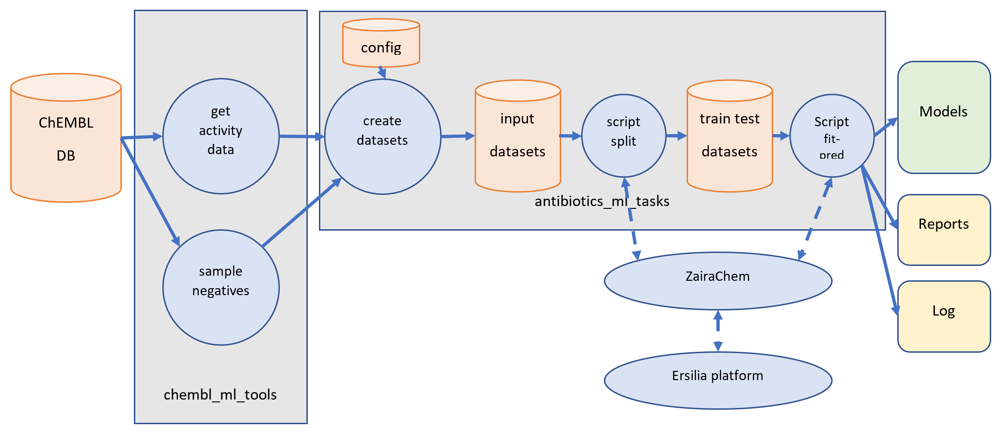

# antimicrobial-ml-tasks
Antimicrobial activity prediction with automated machine learning

# Process overview



# Installation

This process has been developed in Ubuntu Linux. For other environments, it may require adaptations.

The installation instructions assume you have Ubuntu Linux, and that the conda package manager is installed.

## Installation required for part 1 (create datasets)

1. Clone this repository (https://github.com/ersilia-os/antimicrobial_ml_tasks.git)

2. Not required but recommended: create a conda environment for this project. Activate it.

```
conda create -n antimicrobial python=3.10
conda activate antimicrobial
```

3. Install the package https://github.com/ersilia-os/chembl_ml_tools.git , following the instructions in that 
repository. This includes the instructions to install the ChEMBL database in PostgreSQL.


Note: thsi pipeline is prepared followign the existing repository structure. Data will be stored in the `/data` path. This can be changed by changing the `DATAPATH` variable in `code/default.py`.

## Installation required for part 2 (build models)

1. Install the Ersilia Model Hub: https://ersilia.gitbook.io/ersilia-book/ersilia-model-hub/installation

2. Install ZairaChem by following the instructions in the repository: https://github.com/ersilia-os/zaira-chem

3. Copy the directory `bin` from `antimicrobial_ml_tasks` to the directory `~/data`

```
# Assuming you are in directory antimicrobial_ml_tasks
cp -R bin ~/data/
```

# Running part 1 - Create datasets

1. Make sure that the PostgreSQL server containing the ChEMBL database is running. In case of doubt, review step 3 of the installation.

By default, the programs assume that PostgreSQL is running in the local computer, and that the database user `chembl_user` with
password `aaa` has read access to the tables of ChEMBL. This can be changed in program `code/create_datasets.py`.

2. Edit the file `config/pathogens.csv` to select the pathogens for which we need models.

This file has two columns:

- **pathogen_code**: Choose a short code to identify the pathogen, alphanumeric only, **without spaces**. Example: "efaecium".
- **search_text**: A search string, *case insensitive*, to search for the pathogen name in the `organism` field 
in the ChEMBL database. Example: "Enterococcus Faecium".

3. Run the script `pathogens.py`
```
cd code
python pathogens.py
```

This will create folders under `/data` with all the available data for the selected pathogens. An example is provided

4. Run the script `main.py`, passing the pathogen code as argument. This will create several datasets for the specific assays requested (currently, standard_types like MIC are used, but these can be easily modified by changing the `default.py`file and by calling other classes from `generate_datasets.py`)
```
cd code
python main.py <pathogen_code>
```

#  TODO
- the required directory structure under the base path (`~/models`). In the each model's directory
(e.g. `~/models/efaecium/efaecium_organism_anytype`)
there is an `input` subdirectory. The input dataset for that model will be created there.

- the file `model_metadata/dataset.csv` containing a list of all the datasets and their counts.

- the scripts `~/models/split_all.sh` and `~/models/fit_predict_all.sh`.

## Running part 2 - Build models

1. Run the script to perform the train-test split
```
cd ~/models
bash split_all.sh
```

2. Run the script to fit and assess the models
```
bash fit_predict_all.sh
```

# Results

The directory for each model (example: `~/models/saureus/saureus_organism_anytype`) will contain the following subdirectories:

- input: Contains the files:
  - input.csv: full input data
  - train.csv: input data for training
  - test.csv: input data for test
  - input_rejected.csv: cases that ZairaChem has rejected (typically because the molecule's SMILES is not valid)
  
- model: Contains the model definition, in the format used by ZairaChem

- test: Predictions for the test data and assessment reports of the model

- log: The log files resulting from the split, test and predict runs of ZairaChem

The file `~/models/runs.csv` will contain a log of all the ZairaChem runs, with one line per run. Its
fields are: directory, begin date/time, end date/time, exit code.

# FAQ

### 1. Connection error when running create_datasets.py

Error message:
```
psycopg2.OperationalError: connection to server at "localhost" (127.0.0.1), port 5432 failed: Connection refused
        Is the server running on that host and accepting TCP/IP connections?
```
Solution: Assuming the ChEMBL database was correctly installed, this problem usually happens because the postgreSQL service is down:
```
sudo service postgresql start
```
